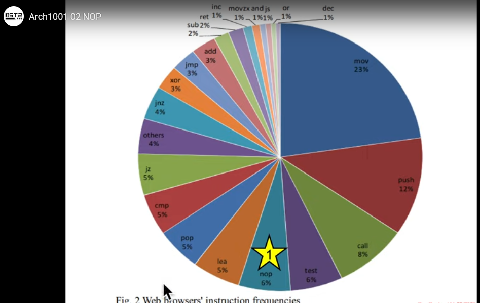

# RE 101

## Static analysis

```sh
file my.bin
```

```sh
strings -a my.bin
strings -a -el my.bin
```

- `xxd` and other hex editors ([hexabyte](https://github.com/thetacom/hexabyte), [ImHex](https://github.com/WerWolv/ImHex), ...)
- [Floss](https://github.com/mandiant/flare-floss): all in one; nice for Rust and Go binaries
- [PEStudio](https://www.winitor.com/)
- [PEiD](https://www.aldeid.com/wiki/PEiD)

### File formats

- [PE format](https://www.openrce.org/reference_library/files/reference/PE%20Format.pdf)
- [man elf](https://manpages.ubuntu.com/manpages/xenial/en/man5/elf.5.html)

## Dynamic analysis

- at least use a VM, a complete lab if you can
    - look at [FlareVM](https://github.com/mandiant/flare-vm)
    - easy win: [REToolkit](https://github.com/mentebinaria/retoolkit)
- (static analysis VM vs dynamic VM) x (Windows + Linux) -> can take a lot of space

- sandbox: [Cuckoo](https://github.com/cuckoosandbox/cuckoo) is not maintained anymore!

### System

- [ProcMon](https://learn.microsoft.com/en-us/sysinternals/downloads/procmon): ctrl+X/E/L
  - [ProcDot](https://www.procdot.com/) is a nice companion tool
- [Process Explorer](https://learn.microsoft.com/en-us/sysinternals/downloads/process-explorer)
- [System Informer](https://systeminformer.sourceforge.io/), once `Process Hacker`
- [Regshot](https://sourceforge.net/projects/regshot/)

### Network

- [Wireshark](https://www.wireshark.org/) and `tcpdump`
- [inetsim](https://www.inetsim.org/)
- [ApateDNS](https://fireeye.market/apps/211380)

## (Dis)assembly at last

- [IDA free](https://hex-rays.com/ida-free/)
   - [IDA shortcuts](https://hex-rays.com/products/ida/support/freefiles/IDA_Pro_Shortcuts.pdf)
- [Binary Ninja](https://binary.ninja/)
- [Ghidra](https://ghidra-sre.org/)
- [Hopper](https://www.hopperapp.com/)
- [radare2](https://rada.re/n/) and [iaito](https://github.com/radareorg/iaito)
- [x64dbg](https://x64dbg.com/) and its plugins
- [Dependency walker](https://www.dependencywalker.com/)


### Lessons

- [OST2](https://p.ost2.fyi/dashboard)
    - [x86-64](https://p.ost2.fyi/courses/course-v1:OpenSecurityTraining2+Arch1001_x86-64_Asm+2021_v1/course/)

### Instructions

- [The ref - Intel](https://software.intel.com/en-us/download/intel-64-and-ia-32-architectures-sdm-combined-volumes-1-2a-2b-2c-2d-3a-3b-3c-3d-and-4)



- [x86 and amd64 instruction reference by Felix Cloutier](https://www.felixcloutier.com/x86/)

----
- [nop](https://www.felixcloutier.com/x86/nop)
- [mov](https://www.felixcloutier.com/x86/mov)
- [lea](https://www.felixcloutier.com/x86/lea)
----
- [push](https://www.felixcloutier.com/x86/push)
- [pop](https://www.felixcloutier.com/x86/pop)
----
- [test](https://www.felixcloutier.com/x86/test)
- [cmp](https://www.felixcloutier.com/x86/cmp)
- [jcc](https://www.felixcloutier.com/x86/jcc)
- [jmp](https://www.felixcloutier.com/x86/jmp)
----
- [call](https://www.felixcloutier.com/x86/call)
- [leave](https://www.felixcloutier.com/x86/leave)
- [ret](https://www.felixcloutier.com/x86/ret)
----
- [xor](https://www.felixcloutier.com/x86/xor)
- [or](https://www.felixcloutier.com/x86/or)
- [and](https://www.felixcloutier.com/x86/and)
- [not](https://www.felixcloutier.com/x86/not)
----
- [add](https://www.felixcloutier.com/x86/add)
- [sub](https://www.felixcloutier.com/x86/sub)
- [mul](https://www.felixcloutier.com/x86/mul)
- [div](https://www.felixcloutier.com/x86/div)
----
- [scas:scasb:scasw:scasd](https://www.felixcloutier.com/x86/scas:scasb:scasw:scasd)
- [stos:stosb:stosw:stosd:stosq](https://www.felixcloutier.com/x86/stos:stosb:stosw:stosd:stosq)
- [syscall](https://www.felixcloutier.com/x86/syscall)
- [sysenter](https://www.felixcloutier.com/x86/sysenter)
- [sysexit](https://www.felixcloutier.com/x86/sysexit)
- [sysret](https://www.felixcloutier.com/x86/sysret)
----

### Calling conventions

- [X86_calling_conventions](https://en.wikipedia.org/wiki/X86_calling_conventions)

### Going further

- https://github.com/jstrosch/learning-reverse-engineering
- https://github.com/jstrosch/learning-malware-analysis
- https://github.com/jstrosch/malware-samples
- https://github.com/tylerha97/awesome-reversing
- https://github.com/ReversingID/Awesome-Reversing
- https://github.com/onethawt/reverseengineering-reading-list